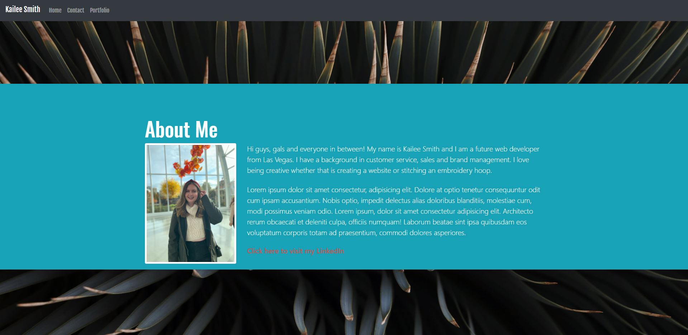
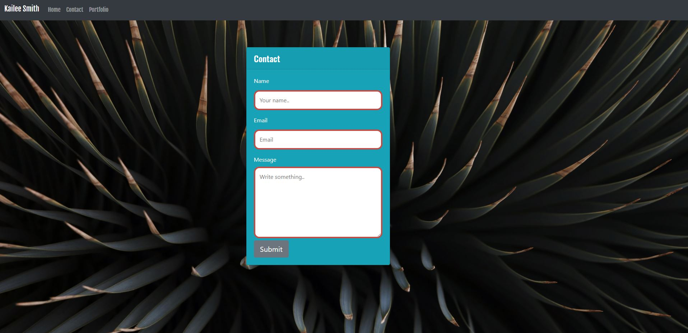
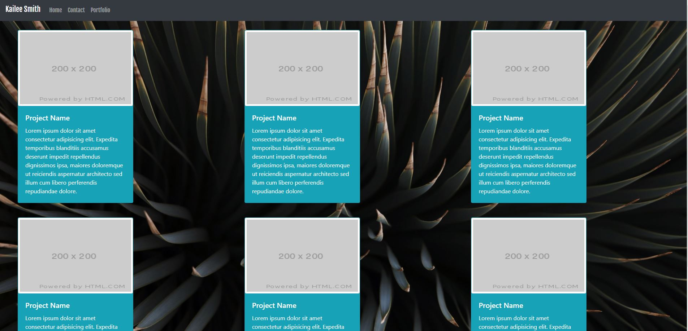

## My Portfolio
I wanted to focus on showcasing my personality and energy through my portfolio. It was also important that the layout remained simple so it had great useability.

# Directions
Create a portfolio with a navbar bar and responsive layout.

# Requirments
-Functional, deployed application

-GitHub repository with README describing the project

-Navbar must be consistent on each page.

-Navbar on each page must contain links to Home/About, Contact, and Portfolio pages.

-All links must work.

-Must use semantic html.

-Each page must have valid and correct HTML. (use a validation service)

-Must contain your personalized information. (bio, name, images, links to social media, etc.)

-Must properly utilize Bootstrap components and grid system.

# Example of Home Page

 # Example of Contact Page
 
 # Example of Portfolio Page
 

